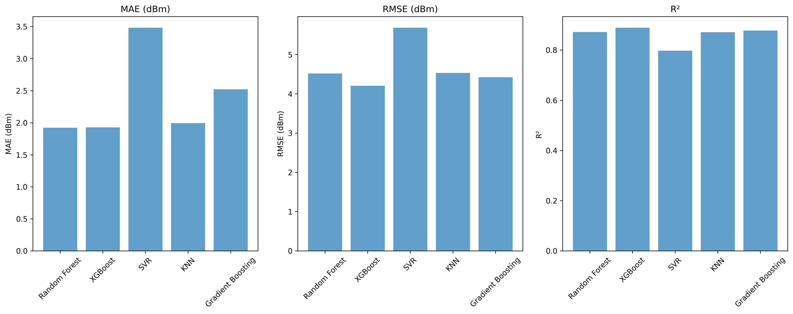
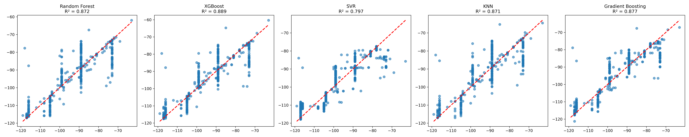
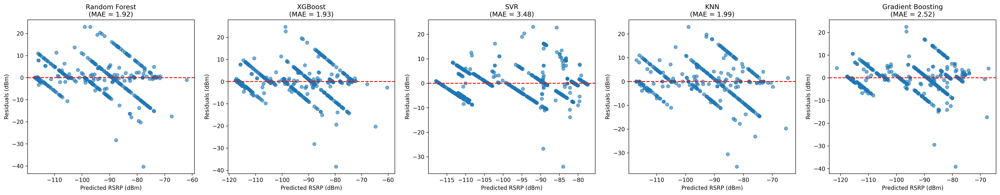
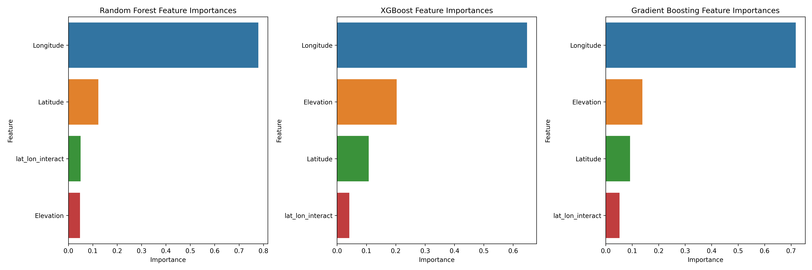

# Machine Learning-Based Prediction and Visualization of Wireless Signal Coverage Using Field Measurements

## Introduction

Wireless signal coverage is one of the key factors affecting the quality of cellular communication. Signal strength can vary significantly due to terrain, buildings, environmental conditions, and network infrastructure. Traditional coverage assessment methods rely heavily on drive tests and propagation models, which are often expensive, time-consuming, and difficult to scale.

This project explores the use of machine learning techniques to predict cellular signal strength from real-world field measurements and visualize coverage patterns across a geographic region. The work was carried out as a Major Project for the Bachelor of Engineering in Computer Science and Engineering (Artificial Intelligence & Machine Learning) at JSS Academy of Technical Education, Bengaluru.

## Project Overview

The project is based on field measurements collected across Bengaluru through drive testing. Approximately 10,000 signal records were gathered and analyzed to study variations in Reference Signal Received Power (RSRP). After preprocessing, aggregation, and data cleaning, 5,353 unique geospatial observations were used for model development.

To improve prediction accuracy, elevation data was incorporated alongside geographic coordinates. Several machine learning regression models were trained and compared to identify the most suitable approach for wireless signal strength prediction. The final system also generates interactive coverage maps that provide a visual representation of predicted signal quality.

## Methodology

The workflow consists of four main stages:

1. Collection of real-world cellular signal measurements.
2. Data preprocessing, cleaning, and elevation enrichment.
3. Training and evaluation of machine learning models.
4. Visualization of predicted coverage through interactive geospatial heatmaps.

The following regression algorithms were evaluated:

* Random Forest Regressor
* XGBoost Regressor
* Gradient Boosting Regressor
* Support Vector Regression (SVR)
* K-Nearest Neighbors (KNN)

Model performance was assessed using MAE, RMSE, R² Score, and cross-validation.

## Results

### Model Performance Comparison

Among the evaluated models, XGBoost achieved the highest prediction accuracy with:

* Mean Absolute Error (MAE): 1.93 dBm
* Root Mean Square Error (RMSE): 4.21 dBm
* R² Score: 0.889

### Actual vs Predicted Values

Comparison between actual and predicted RSRP values across all evaluated machine learning models.

### Residual Analysis

Residual plots illustrating prediction errors and model behavior.

### Feature Importance Analysis

Feature importance scores highlighting the contribution of geographic and elevation-based features to signal strength prediction.

The trained model was used to generate high-resolution coverage predictions and visualize wireless signal distribution across the study area.

## Coverage Visualization

### Geospatial Heatmap

Interactive geospatial heatmaps were developed using Folium to visualize coverage patterns, identify low-signal regions, and support wireless network optimization.

## Technologies Used

* Python
* Pandas
* NumPy
* Scikit-learn
* XGBoost
* Folium
* Matplotlib
* Open-Elevation API

## Applications

The developed framework can support:

* Cellular network planning
* Coverage gap identification
* Signal strength analysis
* Network performance optimization
* Geospatial coverage visualization

## Team

Anumeha Anand, 
Arundhati, 
Aryan Prasad, 
Lakki Kunwar

**Guide:** Dr. Anil B C
Department of CSE (AI & ML)
JSS Academy of Technical Education, Bengaluru
